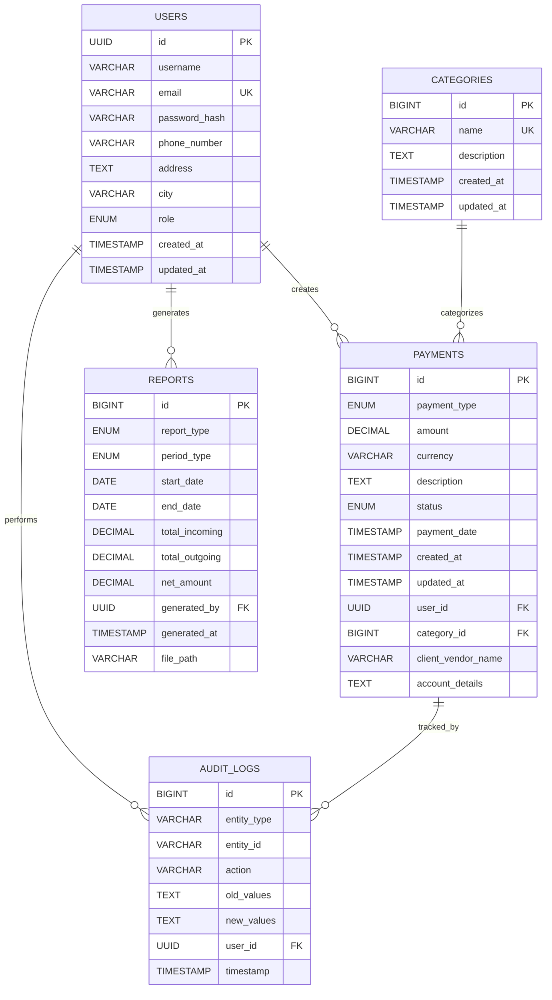
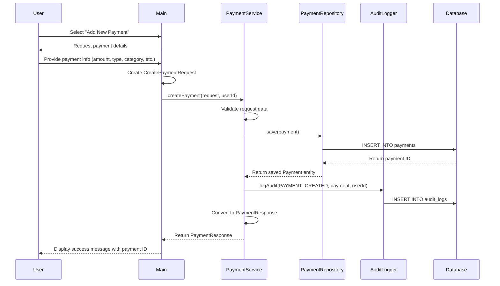
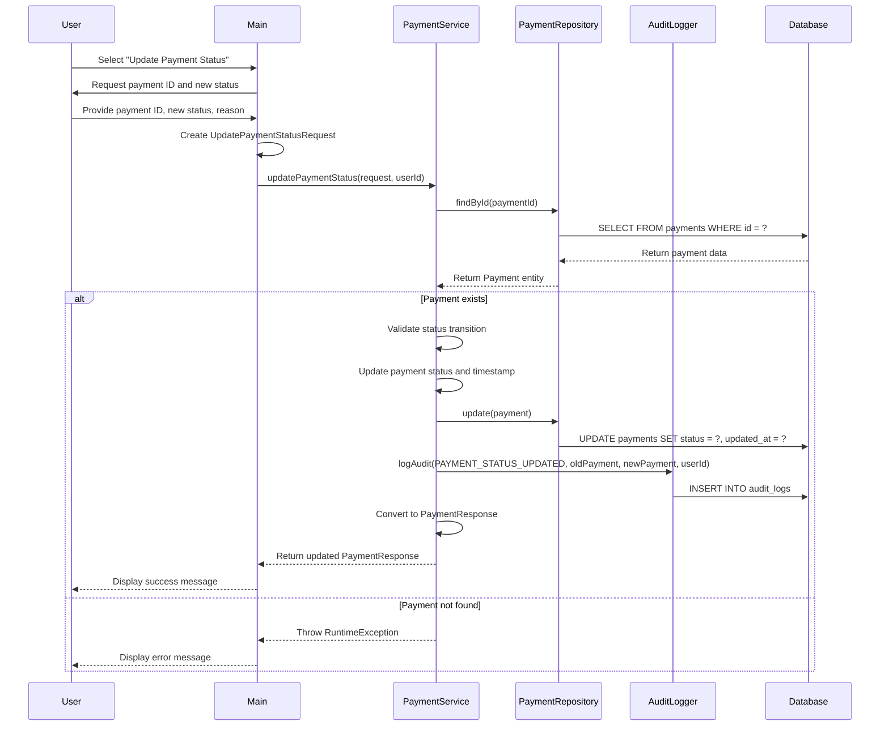
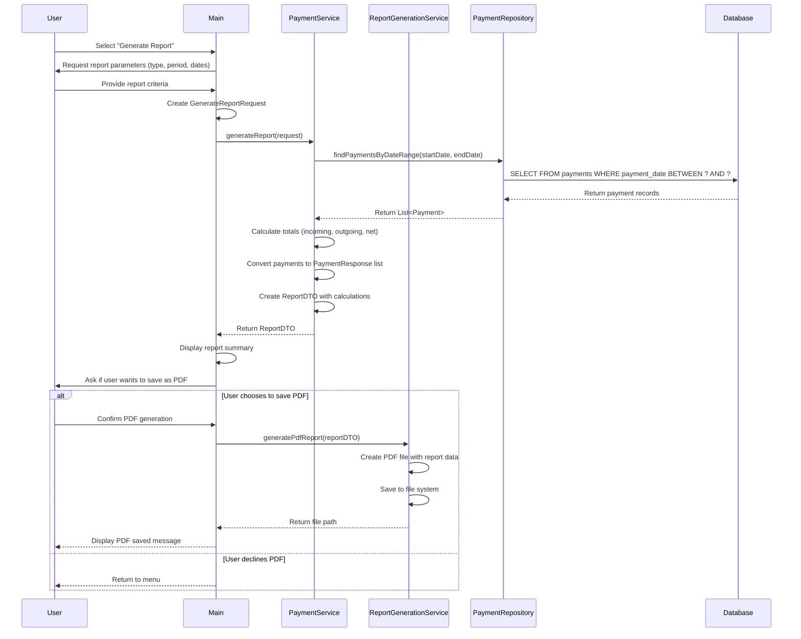

# 💰 Payment Management System

A comprehensive fintech solution for managing incoming and outgoing payments, with robust security, audit trails, and financial reporting.

---

## 📋 Table of Contents

- [🎯 Overview](#-overview)
- [✨ Features](#-features)
- [🛠 Technology Stack](#-technology-stack)
- [🗄 Database Schema](#-database-schema)
- [🏗 System Architecture](#-system-architecture)
- [🚀 Installation](#-installation)
- [📖 Usage](#-usage)
- [📈 Reporting](#-reporting)
- [📚 API Documentation](#-api-documentation)
- [🤝 Contributing](#-contributing)
- [🪪 License](#-license)

---

## 🎯 Overview

The **Payment Management System** helps fintech teams efficiently track and manage all financial transactions. It provides a secure and auditable platform for finance managers to handle payments, generate reports, and maintain a detailed change history.

### Problem Statement

This system addresses key needs such as:

- ✅ Tracking incoming payments (e.g., client invoices)  
- ✅ Managing outgoing payments (e.g., salaries, vendor settlements)  
- ✅ Categorizing and monitoring payment statuses  
- ✅ Generating insightful financial reports  
- ✅ Maintaining audit logs for every transaction  
- ✅ Implementing role-based access control  

---

## ✨ Features

### Core Functionalities

- 🔁 **Payment Management** — Create, update, and view payment records  
- 🚦 **Status Tracking** — Track statuses: `Pending`, `Processing`, `Completed`, `Failed`, `Cancelled`  
- 🗂 **Categorization** — Organize payments by type: `Salary`, `Vendor`, `Client`  
- 📊 **Reporting** — Generate monthly and quarterly financial reports  
- 🕵️‍♂️ **Audit Logging** — Log every user and system action  
- 👥 **User Roles** — Role-based access for Admins, Finance Managers, and Viewers  

### Security Features

- 🔐 User authentication & authorization  
- ✅ Data integrity validation  
- 🧾 Full audit history  
- 🔒 Role-based permissions  

---

## 🛠 Technology Stack

- **Language**: Java 11+  
- **Framework**: Spring Boot  
- **Database**: H2 (development), PostgreSQL (production)  
- **Build Tool**: Maven  
- **Architecture**: Clean Architecture adhering to SOLID principles  
- **Design Patterns**: Repository, DTO, Builder  

---

## 🗄 Database Schema

### ER Diagram (Mermaid)

## 🏗 System Architecture

> Full class and sequence diagrams are available in the `docs` folder.

---

### Class Diagram (Mermaid)

```mermaid
classDiagram
    %% Entities
    class User {
        -UUID id
        -String username
        -String email
        -String passwordHash
        -String phoneNumber
        -String address
        -String city
        -UserRole role
        -LocalDateTime createdAt
        -LocalDateTime updatedAt
        +builder() User
        +getId() UUID
        +getUsername() String
        +getEmail() String
        +getRole() UserRole
    }

    class Payment {
        -Long id
        -PaymentType paymentType
        -BigDecimal amount
        -String currency
        -String description
        -PaymentStatus status
        -LocalDateTime paymentDate
        -LocalDateTime createdAt
        -LocalDateTime updatedAt
        -UUID userId
        -Long categoryId
        -String clientVendorName
        -String accountDetails
        +builder() Payment
        +getId() Long
        +getAmount() BigDecimal
        +getStatus() PaymentStatus
    }

    class Category {
        -Long id
        -String name
        -String description
        -LocalDateTime createdAt
        -LocalDateTime updatedAt
        +builder() Category
        +getId() Long
        +getName() String
    }

    class AuditLog {
        -Long id
        -String entityType
        -String entityId
        -String action
        -String oldValues
        -String newValues
        -UUID userId
        -LocalDateTime timestamp
        +builder() AuditLog
        +getAction() String
        +getTimestamp() LocalDateTime
    }

    class Report {
        -Long id
        -ReportType reportType
        -PeriodType periodType
        -LocalDate startDate
        -LocalDate endDate
        -BigDecimal totalIncoming
        -BigDecimal totalOutgoing
        -BigDecimal netAmount
        -UUID generatedBy
        -LocalDateTime generatedAt
        -String filePath
        +builder() Report
        +getReportType() ReportType
    }

    %% DTOs
    class UserDTO {
        -UUID id
        -String username
        -String email
        -String passwordHash
        -String phoneNumber
        -String address
        -String city
        -String role
        +builder() UserDTO
        +setUsername(String) void
        +setPhoneNumber(String) void
    }

    class PaymentResponse {
        -Long id
        -PaymentType paymentType
        -BigDecimal amount
        -String currency
        -PaymentStatus status
        -String categoryName
        -String clientVendorName
        -LocalDateTime createdAt
        +builder() PaymentResponse
        +getId() Long
        +getAmount() BigDecimal
    }

    class ReportDTO {
        -ReportType reportType
        -LocalDate startDate
        -LocalDate endDate
        -BigDecimal totalIncoming
        -BigDecimal totalOutgoing
        -BigDecimal netAmount
        -List~PaymentResponse~ payments
        +builder() ReportDTO
        +getTotalIncoming() BigDecimal
        +getPayments() List~PaymentResponse~
    }

    %% Request DTOs
    class CreatePaymentRequest {
        -PaymentType paymentType
        -BigDecimal amount
        -String currency
        -String description
        -Long categoryId
        -String categoryName
        -LocalDateTime paymentDate
        -String clientVendorName
        -String accountDetails
        +builder() CreatePaymentRequest
    }

    class UpdatePaymentStatusRequest {
        -Long paymentId
        -PaymentStatus newStatus
        -String changeReason
        -String additionalNotes
        +builder() UpdatePaymentStatusRequest
    }

    class GenerateReportRequest {
        -ReportType reportType
        -PeriodType periodType
        -LocalDate startDate
        -LocalDate endDate
        +builder() GenerateReportRequest
    }

    %% Services
    class OnboardUserService {
        <<interface>>
        +createUser(UserDTO) UserDTO
        +getUserById(UUID) Optional~UserDTO~
        +getUserByEmail(String) Optional~UserDTO~
        +getAllUsers() List~UserDTO~
        +updateUser(UserDTO) UserDTO
        +isEmailTaken(String) boolean
        +getUsersByName(String) List~UserDTO~
    }

    class OnboardUserServiceImpl {
        -UserDAO userDAO
        -AuditLogger auditLogger
        +createUser(UserDTO) UserDTO
        +getUserById(UUID) Optional~UserDTO~
        +getUserByEmail(String) Optional~UserDTO~
        +getAllUsers() List~UserDTO~
        +updateUser(UserDTO) UserDTO
        +isEmailTaken(String) boolean
        +getUsersByName(String) List~UserDTO~
    }

    class PaymentService {
        <<interface>>
        +createPayment(CreatePaymentRequest, String) PaymentResponse
        +updatePaymentStatus(UpdatePaymentStatusRequest, String) PaymentResponse
        +getAllPayments() List~PaymentResponse~
        +getPaymentsByType(PaymentType) List~PaymentResponse~
        +getPaymentsByStatus(PaymentStatus) List~PaymentResponse~
        +generateReport(GenerateReportRequest) ReportDTO
    }

    class PaymentServiceImpl {
        -PaymentRepositoryImpl paymentRepository
        -AuditLogger auditLogger
        +createPayment(CreatePaymentRequest, String) PaymentResponse
        +updatePaymentStatus(UpdatePaymentStatusRequest, String) PaymentResponse
        +getAllPayments() List~PaymentResponse~
        +getPaymentsByType(PaymentType) List~PaymentResponse~
        +getPaymentsByStatus(PaymentStatus) List~PaymentResponse~
        +generateReport(GenerateReportRequest) ReportDTO
    }

    class ReportGenerationService {
        <<interface>>
        +generatePdfReport(ReportDTO) String
    }

    class ReportGenerationServiceImpl {
        +generatePdfReport(ReportDTO) String
    }

    %% DAOs and Repositories
    class UserDAO {
        <<interface>>
        +save(UserDTO) UserDTO
        +findById(UUID) Optional~UserDTO~
        +findByEmail(String) Optional~UserDTO~
        +findAll() List~UserDTO~
        +update(UserDTO) UserDTO
        +existsByEmail(String) boolean
        +findByUsernameContaining(String) List~UserDTO~
    }

    class UserDAOImplementation {
        +save(UserDTO) UserDTO
        +findById(UUID) Optional~UserDTO~
        +findByEmail(String) Optional~UserDTO~
        +findAll() List~UserDTO~
        +update(UserDTO) UserDTO
        +existsByEmail(String) boolean
        +findByUsernameContaining(String) List~UserDTO~
    }

    class PaymentRepositoryImpl {
        +save(Payment) Payment
        +findById(Long) Optional~Payment~
        +findAll() List~Payment~
        +update(Payment) Payment
        +findByType(PaymentType) List~Payment~
        +findByStatus(PaymentStatus) List~Payment~
        +findByDateRange(LocalDate, LocalDate) List~Payment~
    }

    %% Utilities
    class AuditLogger {
        +logAction(String, String, String, String, String, String) void
        +getAuditTrail(String, String) List~AuditLog~
    }

    class DatabaseConnectionManager {
        +getConnection() Connection
        +closeConnection() void
    }

    class DatabaseInitializer {
        +createTables() void
        +dropAllTables() void
    }

    %% Enums
    class UserRole {
        <<enumeration>>
        ADMIN
        FINANCE_MANAGER
        VIEWER
    }

    class PaymentType {
        <<enumeration>>
        INCOMING
        OUTGOING
    }

    class PaymentStatus {
        <<enumeration>>
        PENDING
        PROCESSING
        COMPLETED
        FAILED
        CANCELLED
    }

    class ReportType {
        <<enumeration>>
        FINANCIAL
        AUDIT
    }

    class PeriodType {
        <<enumeration>>
        MONTHLY
        QUARTERLY
        YEARLY
    }

    %% Relationships
    OnboardUserService <|.. OnboardUserServiceImpl
    PaymentService <|.. PaymentServiceImpl
    ReportGenerationService <|.. ReportGenerationServiceImpl
    UserDAO <|.. UserDAOImplementation

    OnboardUserServiceImpl --> UserDAO
    OnboardUserServiceImpl --> AuditLogger
    PaymentServiceImpl --> PaymentRepositoryImpl
    PaymentServiceImpl --> AuditLogger

    User --> UserRole
    Payment --> PaymentType
    Payment --> PaymentStatus
    Report --> ReportType
    Report --> PeriodType

    CreatePaymentRequest --> PaymentType
    UpdatePaymentStatusRequest --> PaymentStatus
    GenerateReportRequest --> ReportType
    GenerateReportRequest --> PeriodType

    PaymentResponse --> PaymentType
    PaymentResponse --> PaymentStatus
    ReportDTO --> ReportType
    ReportDTO --> PaymentResponse

    UserDTO --> User : "maps to"
    PaymentResponse --> Payment : "maps to"
    ReportDTO --> Report : "maps to"

    PaymentRepositoryImpl --> DatabaseConnectionManager
    UserDAOImplementation --> DatabaseConnectionManager
    AuditLogger --> DatabaseConnectionManager
```

---
### Sequence Diagram (Mermaid)
## Add Payment Flow

## Update Payment Status Flow

## Generate Report Flow

